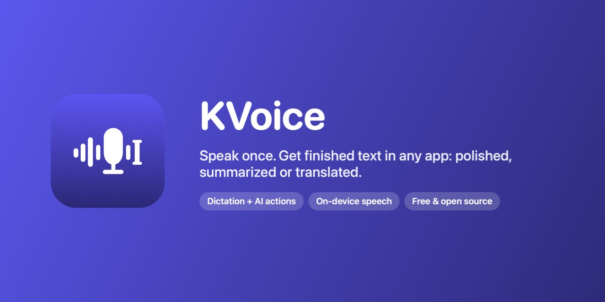
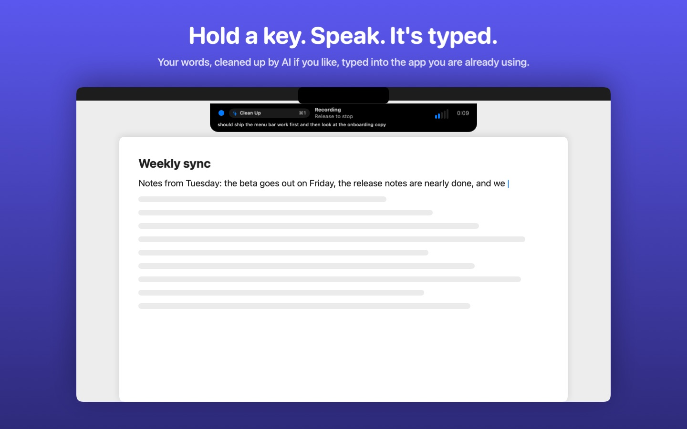
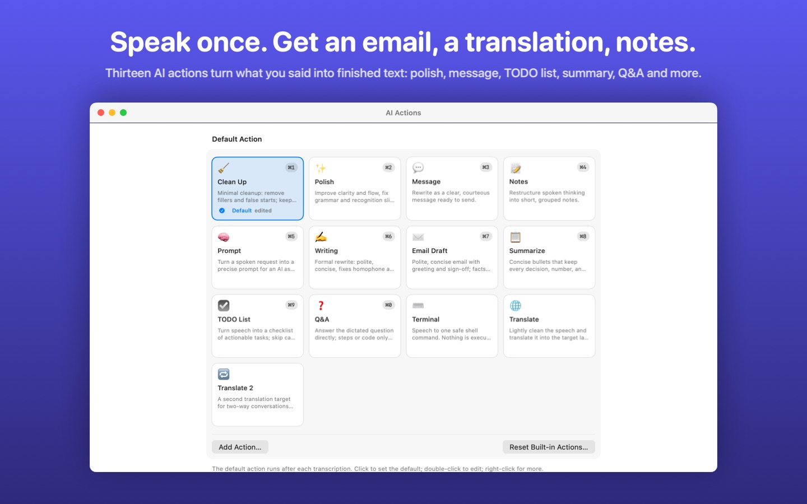
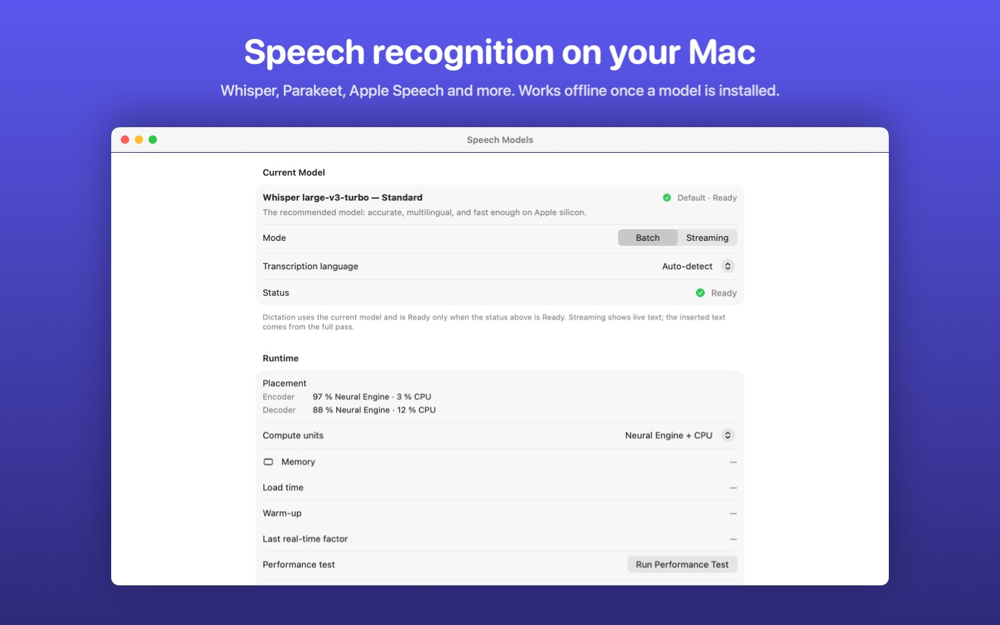
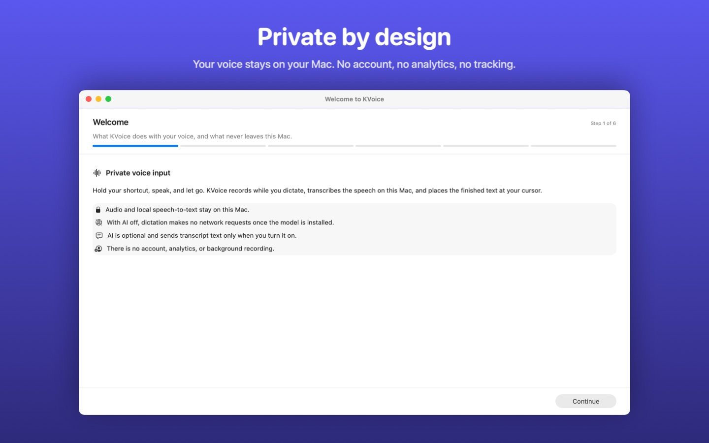

<p align="center">
  
</p>

<h3 align="center">Speak once. Get finished text, typed where you work.</h3>

<p align="center">
  
  <a href="https://github.com/kccarlos/kvoice/releases/latest"></a>
  <a href="LICENSE"></a>
  
  
  
  
  <a href="https://github.com/kccarlos/kvoice/stargazers"></a>
</p>

**Dictation and AI actions in one step.** Hold your shortcut, speak, let
go, and KVoice types finished text where your cursor is: cleaned up,
polished, turned into an email, a message, notes or a TODO list,
summarized, answered, or translated. It works in any app on your Mac (a
mail draft, a chat box, a document, a terminal), and your speech is
transcribed **on your Mac**.

- Ramble about a meeting → a clear, polite **email draft**.
- Speak Chinese → **English text** (or any language pair you set).
- Talk through your week → a **TODO list** of actionable tasks.

Want plain dictation? That works too, with no AI at all.

<p align="center">
  
</p>

## Why KVoice

- **From voice to finished text in one step.** Thirteen built-in AI actions:
  Clean Up, Polish, Message, Notes, Prompt, Writing, Email Draft,
  Summarize, TODO List, Q&A, Terminal, Translate and Translate 2. Edit them
  or write your own.
- **Works in any app.** The result goes into the app you are already using,
  not into a KVoice window you then copy from.
- **Your choice of AI engine.** **Apple Intelligence on this Mac** (macOS 26
  or later: no account, no key, nothing leaves the Mac), or any
  OpenAI-compatible service with your own key, including a model on your
  own machine with Ollama.
- **Private, on-device transcription.** Speech recognition runs on your
  Mac's Neural Engine and audio is never uploaded. AI only runs when you
  turn it on, with the engine you chose.
- **Fast, accurate local models.** Whisper large-v3-turbo by default (about a
  hundred languages), plus Parakeet, Nemotron, SenseVoice and Paraformer,
  and **Apple Speech**, the recognizer built into macOS 26 and later.
- **Free and open source.** MIT licensed. No subscription, no in-app
  purchases.

## How it works

1. **Hold** your shortcut (for example Control-Shift-Space).
2. **Speak.** A small recorder shows what it hears, and which AI action
   will run, without taking focus from your app.
3. **Let go.** KVoice transcribes on your Mac, runs your AI action (if you
   use one), and types the finished text at your cursor.

Pick the default action from the menu bar. Turn on action triggers and you
can also start a sentence with an action's trigger word ("draft email",
"translate", "todo list", …) to use another one. Prefer hands-free? Switch
to **Toggle** (press once to start, again to stop) or **Hybrid** (tap for
hands-free, hold for push-to-talk).

<p align="center">
  
</p>

## What it does

- **Push-to-talk, toggle or hybrid dictation** from a global shortcut, with a
  Mini or Notch recorder that never steals focus.
- **Local speech recognition** that works offline once a model is
  downloaded. Speech Models lets you compare, download and switch models.
- **Text goes straight into the app.** When there is nowhere safe to put it
  (no text field, a password field), KVoice copies it to the clipboard
  instead and tells you, so nothing you said is lost.
- **Dictionary.** Teach it names and jargon so they come out spelled your way.
- **AI Actions.** Thirteen built-in actions, editable, plus your own; each
  can use a user profile you write, and (full edition) the text you have
  selected as context.
- **History, optional.** Search past dictations, re-transcribe them with a
  different model, transcribe an audio file, and export to CSV, Markdown or
  plain text. You choose how long anything is kept.
- **Shortcuts, Siri and Spotlight** actions to start and stop dictation.
- **English and Simplified Chinese** interface.

<p align="center">
  
</p>

## Download

KVoice comes in two editions, built from the same code. Both are free.

- **Mac App Store edition** (coming soon): the easiest install and automatic
  updates. The store listing will be linked here once it is live.
- **Full edition from GitHub:** download the DMG from the
  [latest release](https://github.com/kccarlos/kvoice/releases/latest), open
  it, drag **KVoice** to Applications, and open it. It is signed with a
  Developer ID and notarized by Apple.

> Releases start with version 0.1.0. Until the first one is published, you
> can [build KVoice from source](#build-from-source).

### Which edition should I choose?

Apps from the Mac App Store must run in Apple's **App Sandbox**, which does
not let one app read or change another app's text fields. So the App Store
edition types your words as keystrokes and leaves out the features that need
to read other apps.

| | App Store edition | Full edition (GitHub) |
| --- | --- | --- |
| On-device speech recognition, all models | Yes | Yes |
| Dictionary, History, AI Actions, Apple Intelligence | Yes | Yes |
| How text is inserted | Typed as keystrokes into the app in front | Inserted directly through Accessibility, with typed keystrokes as a fallback |
| Line breaks in dictated text | Become spaces | Kept where the app accepts them |
| Selection Actions (run an AI action on selected text) | No | Yes |
| "Include selected text" as AI context | No | Yes |
| A lone modifier key (for example Right Option) as the shortcut | No, use a key combination | Yes |
| Middle mouse button to start recording | No | Yes |
| Escape to cancel while another app is in front | No, set a Cancel shortcut instead | Yes |
| Updates | Through the App Store | Download the new release |

Both editions keep their own settings and history, so switching means
setting up again.

## Permissions, in plain words

| Permission | Why KVoice asks | When |
| --- | --- | --- |
| **Microphone** | To hear you while you hold the shortcut. Audio is processed on your Mac. | Your first dictation, or the microphone test in setup |
| **Accessibility** | To put the text into the app you are using. The App Store edition uses only the part that lets it type keystrokes, and cannot read other apps' text. | During setup, before the first insertion |

KVoice never asks for either at launch. Without Accessibility it still
transcribes, and copies the text to the clipboard for you to paste.

## Privacy

- **Your voice stays on your Mac.** Audio is transcribed locally and never
  uploaded.
- **AI Actions are off by default.** With them off, KVoice is designed to
  use the network only to download the speech models you choose, plus the
  one short test request when you check an AI configuration yourself.
- **With AI Actions on,** the transcript goes straight from your Mac to the
  engine you picked, never to us. With Apple Intelligence on this Mac,
  nothing leaves it.
- **No servers, accounts, analytics or telemetry.** API keys are kept in a
  file only your user account can read, never in the settings file. The
  diagnostics log stays on your Mac and never holds your words.

Every detail, engine by engine: [PRIVACY.md](PRIVACY.md).

<p align="center">
  
</p>

## FAQ

<details>
<summary><b>Does KVoice need the internet?</b></summary>

Only to download a speech model, and for AI Actions if you choose an online
engine. Dictation itself works offline.
</details>

<details>
<summary><b>What does it cost?</b></summary>

Nothing. Both editions are free. If you connect AI Actions to a paid service,
that service may charge you for its use; Apple Intelligence and a local
Ollama model cost nothing.
</details>

<details>
<summary><b>Which speech model should I use?</b></summary>

Start with the recommended Whisper model (about 650 MB). It handles about a
hundred languages. On macOS 26 or later, Apple Speech needs no download from
KVoice at all. The [User Guide](Docs/User-Guide.md#speech-models) compares
the others.
</details>

<details>
<summary><b>Does it work in every app?</b></summary>

It works in most apps that accept typed text. When there is nowhere to put
the text, KVoice copies it to the clipboard and tells you.
</details>

<details>
<summary><b>Is my clipboard used?</b></summary>

Not when insertion succeeds. The clipboard is written only when KVoice cannot
put the text anywhere, or when you ask it to copy.
</details>

<details>
<summary><b>Can I use my own AI model?</b></summary>

Yes. Anything that speaks the OpenAI Chat Completions API works, including a
local Ollama server, OpenAI, Gemini, Anthropic, OpenRouter, Groq, Cerebras
and Azure OpenAI. Plain `http://` is accepted only for `localhost`.
</details>

<details>
<summary><b>Where is the app after I open it?</b></summary>

In the menu bar. KVoice has no Dock icon. On first launch a short setup
guide walks you through the speech model, the microphone, Accessibility and
your shortcut.
</details>

<details>
<summary><b>macOS says a permission is granted, but KVoice says it is not.</b></summary>

See the [FAQ in the User Guide](Docs/User-Guide.md#faq).
</details>

## Requirements

- A Mac with Apple silicon, running macOS 15 or later
- Disk space for a speech model: about 650 MB for the recommended one (the
  others range from about 220 MB to 1.7 GB)
- Apple Speech and Apple Intelligence need macOS 26 or later

## Build from source

You need Xcode (the build uses its toolchain; the Command Line Tools alone are
not enough).

```sh
git clone https://github.com/kccarlos/kvoice.git
cd kvoice
./Scripts/build_app.sh Debug
ditto .build/xcode-derived/Build/Products/Debug/kvoice.app ~/Applications/kvoice.app
open ~/Applications/kvoice.app
```

Use `ditto`, not `cp -R`: `cp -R` can break the code signature, and macOS then
quietly refuses the Accessibility permission. The first model load takes a few
minutes while Core ML compiles the model for the Neural Engine.

Run the tests with `./Scripts/test.sh`. Do not run bare `swift build` or
`swift test`; [Docs/Build.md](Docs/Build.md) explains why.

## Documentation

| For | Read |
| --- | --- |
| Using KVoice | [Docs/User-Guide.md](Docs/User-Guide.md) |
| What is sent where | [PRIVACY.md](PRIVACY.md) |
| How the code is organized | [Docs/Architecture.md](Docs/Architecture.md) and [Docs/README.md](Docs/README.md) |
| What changed | [CHANGELOG.md](CHANGELOG.md) |

## Contributing

Bug reports, ideas, translations, docs and code are all welcome. See
[CONTRIBUTING.md](CONTRIBUTING.md) and the
[Code of Conduct](CODE_OF_CONDUCT.md), and report security issues privately
([SECURITY.md](SECURITY.md)).

If KVoice saves you some typing, a star on GitHub helps other people find it.

## License

[MIT](LICENSE). Dependency and model licenses are in
[THIRD_PARTY_NOTICES.md](THIRD_PARTY_NOTICES.md). Every code dependency is MIT
or Apache-2.0. Speech models are downloaded, not bundled, and carry their own
licenses.
