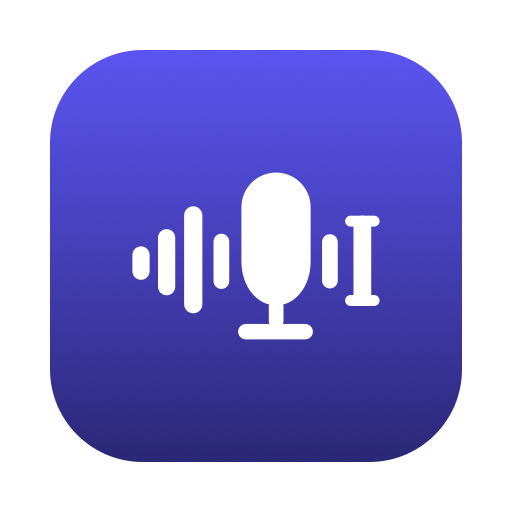

<p align="center">
  
</p>

<h1 align="center">kvoice</h1>

<p align="center">
  <strong>Hold a key, speak, and your words appear where you were already typing.</strong>
</p>

<p align="center">
  <a href="LICENSE"></a>
  
  
  
</p>

kvoice is a dictation utility that lives in the menu bar of your Apple Silicon
Mac. Hold your shortcut, speak, let go, and the text is typed into whatever app
you were using: a mail draft, a chat box, a code editor, a terminal. Speech is
transcribed **on your Mac**. Your voice never leaves it.

AI clean-up and translation are there if you want them, and **off until you
turn them on**.

> **Status: pre-release.** kvoice has not had its first release yet. Until
> it does, you build it from source (see [Build from source](#build-from-source)).
> When releases start, they appear on this repository's Releases page.

<!-- Screenshots: to be added before the first release. -->

## What it does

- **Push-to-talk dictation.** Hold the shortcut, speak, release. Or switch to
  **Toggle** (press once to start, again to stop) or **Hybrid** (a tap starts
  a hands-free recording, a hold works as push-to-talk). A small recorder
  shows what is happening without taking focus from your app.
- **Local speech recognition.** Whisper large-v3-turbo through Core ML on the
  Neural Engine by default. Works offline once the model is downloaded. Speech
  Models offers more: Parakeet, Nemotron, SenseVoice, Paraformer, and on
  macOS 26 or later, **Apple Speech**, the model built into macOS.
- **Text goes straight into the app.** kvoice inserts through the macOS
  Accessibility APIs instead of pasting, so your clipboard is left alone.
  When there is nowhere to insert (no text field focused, a password field),
  the text is copied to the clipboard instead, and kvoice tells you so.
- **Dictionary.** Teach it names and jargon so they come out spelled your way.
- **AI Actions, optional.** Run the transcript through a language model to clean
  up filler words, polish it, turn it into a message, notes, an email draft, a
  summary or a to-do list, translate it, and more. Thirteen actions ship, and you
  can edit them or write your own. Choose an action by saying its trigger word,
  or pick the default from the menu bar.
- **Your choice of AI engine.** Any OpenAI-compatible endpoint (Ollama on
  your own machine, OpenAI, Gemini, Anthropic, OpenRouter, Groq, Cerebras,
  Azure OpenAI, or a custom URL), or **Apple Intelligence on this Mac** (macOS 26 or later): no
  endpoint, no key, nothing leaves the Mac.
- **History, optional.** Search past dictations, re-transcribe them with a
  different model, transcribe an audio file, and export to CSV, Markdown or
  plain text. You choose how long anything is kept, and whether recordings
  are kept at all.
- **Shortcuts and Siri.** Start and stop dictation from the Shortcuts app,
  Spotlight or Siri.
- **English and Simplified Chinese** interface.

## Two editions

kvoice is built from one codebase in two editions:

| | Direct download (DMG) | Mac App Store |
| --- | --- | --- |
| Signing | Developer ID, notarized by Apple | App Store |
| Sandbox | No | Yes |
| How text is inserted | Accessibility APIs, with typed keystrokes as a fallback for fields that refuse direct insertion | Typed keystrokes only. The sandbox does not allow one app to edit another app's text fields directly |
| Selection Actions (run an AI action on the text you have selected) | Yes | No, because they read the selection through Accessibility |
| Modifier-only and middle-mouse triggers | Yes | No. Use a key combination such as Control-Shift-Space |
| Apple's Private Cloud Compute as an AI engine | No | Where Apple makes it available (macOS 27 or later, opt-in) |

Everything else, including the local models, AI Actions, History and the
Dictionary, is the same.

## Privacy

- Audio is transcribed **on your Mac** and is never uploaded.
- With AI Actions off (the default), kvoice is designed to make no network
  requests except downloading the speech models you choose, and the one short
  test request sent when you check an AI configuration yourself (Verify & Save,
  Test). This is how the app is built and tested; it has not yet been
  confirmed by a recorded network capture.
- With AI Actions on, the transcript and the action's instructions go to the
  engine you picked: your endpoint, or Apple's Private Cloud Compute. With
  Apple Intelligence on this Mac, nothing leaves it. Clipboard or selected text
  is sent only for actions you set up to include it.
- API keys are stored in a separate file readable only by your user account,
  never in the settings file.
- No analytics, no telemetry, no accounts. The diagnostics log stays on your
  Mac and holds counters and state names, never your words.

The details, engine by engine: [PRIVACY.md](PRIVACY.md).

## Requirements

- A Mac with Apple Silicon, running macOS 15 or later
- About 650 MB of disk for the recommended speech model, downloaded during
  setup (the other models range from about 220 MB to 1.7 GB)
- Microphone permission, and Accessibility permission to insert text. Both are
  requested when first needed, not at launch.
- Optional features need newer systems: Apple Speech and Apple Intelligence
  need macOS 26, Private Cloud Compute needs macOS 27.

## Install

Releases are not available yet. When they are:

- **Direct download:** open the DMG from the Releases page, drag **kvoice** to
  Applications, and open it.
- **Mac App Store:** install it from the store listing, which will be linked
  here.

kvoice has no Dock icon. Look for it in the menu bar. On first launch a short
setup guide walks you through the speech model, the microphone, Accessibility,
and your shortcut.

## Build from source

You need Xcode (the build uses its toolchain; the Command Line Tools alone are
not enough).

```sh
git clone https://github.com/kccarlos/kvoice.git
cd kvoice
./Scripts/build_app.sh Debug
ditto .build/xcode-derived/Build/Products/Debug/kvoice.app ~/Applications/kvoice.app
open ~/Applications/kvoice.app
```

Use `ditto`, not `cp -R`: `cp -R` can break the code signature, and macOS then
quietly refuses the Accessibility permission. The first model load takes a few
minutes while Core ML compiles the model for the Neural Engine. After that it
is fast.

Run the tests with `./Scripts/test.sh`. Do not run bare `swift build` or
`swift test`; [Docs/Build.md](Docs/Build.md) explains why.

## Permissions, explained

| Permission | Why kvoice asks | When |
| --- | --- | --- |
| Microphone | To hear you while you hold the shortcut. Audio is processed on the Mac | Your first dictation, or the microphone test in setup |
| Accessibility | To put the text into the app you are using. The App Store edition uses only the part of this permission that lets it type keystrokes | During setup, before the first insertion |

kvoice never asks for either at launch. Without Accessibility it still
transcribes, and copies the text to the clipboard for you to paste. If a permission looks granted in
System Settings but kvoice says it is not, see the
[FAQ in the User Guide](Docs/User-Guide.md#faq).

## FAQ

**Does kvoice need the internet?**
Only to download a speech model, and for AI Actions if you choose an online
engine. Dictation itself works offline.

**Which model should I use?**
Start with the recommended Whisper model. It handles about a hundred languages.
The [User Guide](Docs/User-Guide.md#speech-models) compares the others.

**Does it work in every app?**
It works in most apps that accept typed text. Some apps expose no text field to
the system. When there is nowhere to insert, kvoice copies the text to the
clipboard and tells you, so nothing you said is lost.

**Is my clipboard used?**
Not when insertion succeeds. The clipboard is written only when kvoice cannot
find anywhere to put the text, or when you ask it to copy.

**Can I use my own AI model?**
Yes. Anything that speaks the OpenAI Chat Completions API works, including a
local Ollama server. Plain `http://` is accepted only for
`localhost`.

More questions: [Docs/User-Guide.md](Docs/User-Guide.md#faq).

## Documentation

| For | Read |
| --- | --- |
| Using kvoice | [Docs/User-Guide.md](Docs/User-Guide.md) |
| What is sent where | [PRIVACY.md](PRIVACY.md) |
| Contributing | [CONTRIBUTING.md](CONTRIBUTING.md) and [Docs/README.md](Docs/README.md) |
| Reporting a vulnerability | [SECURITY.md](SECURITY.md) |
| What changed | [CHANGELOG.md](CHANGELOG.md) |

## License

[MIT](LICENSE). Dependency and model licenses are in
[THIRD_PARTY_NOTICES.md](THIRD_PARTY_NOTICES.md). Every code dependency is MIT
or Apache-2.0. Speech models are downloaded, not bundled, and carry their own
licenses.
